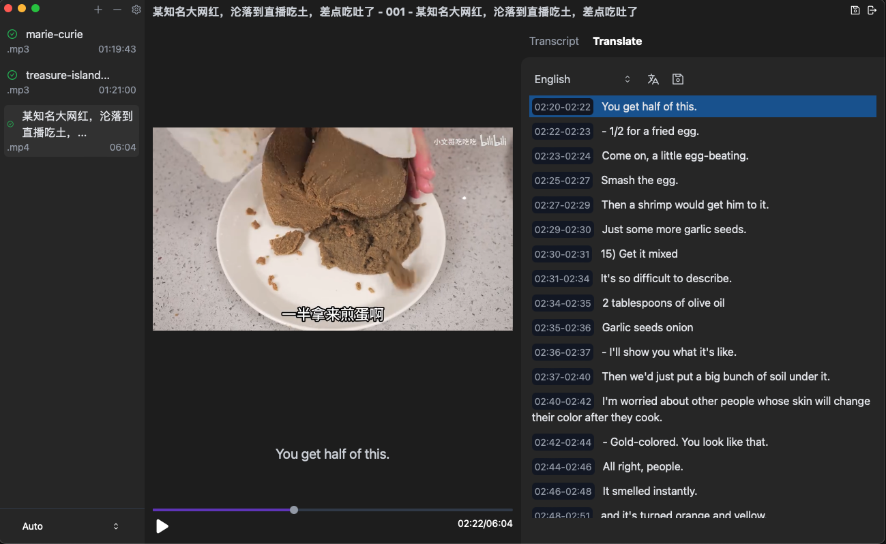
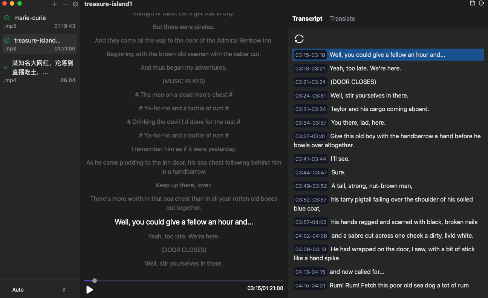
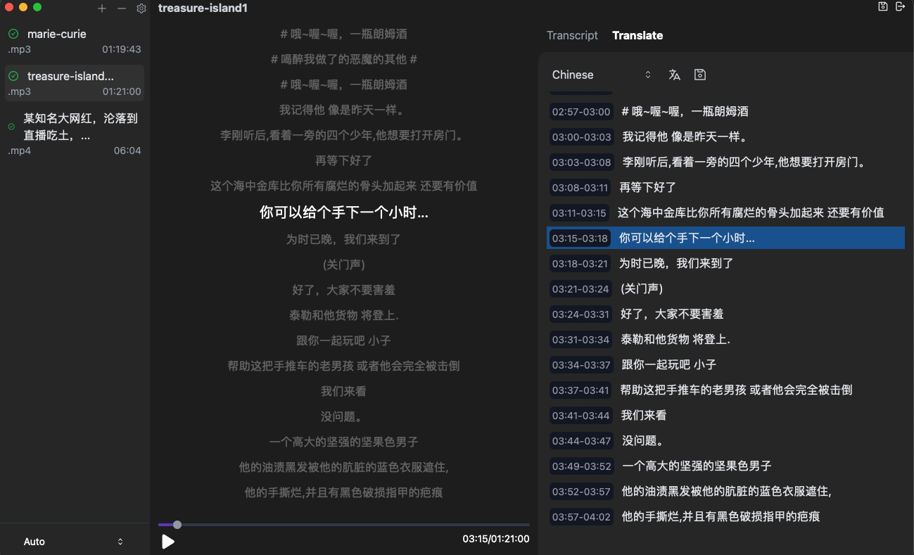

# VidTranslate

## Whisper Models for stt

- `https://ggml.ggerganov.com/ggml-model-whisper-large-q5_0.bin`
- `https://ggml.ggerganov.com/ggml-model-whisper-medium-q5_0.bin`

## Llama models for translating

- `https://huggingface.co/notjjustnumbers/madlad400-3b-mt-Q4_K_M-GGUF/resolve/main/madlad400-3b-mt-q4_k_m.gguf?download=true`

## TODO

- [x] transript screen auto scroll
- [x] file list
- [x] mp3 format
- [x] save transripts to tmp files with time tag
- [x] save file to srt or vvt
- [x] translate with gpt2 or llama
- [x] setting modal
- [x] adjust llama.cpp to handle file as input
- [x] move translate to app.tsx
- [x] refactoring app.tsx
- [x] add stop button to transcripts and translates
- [x] add license
- [ ] finish setting download models etc
